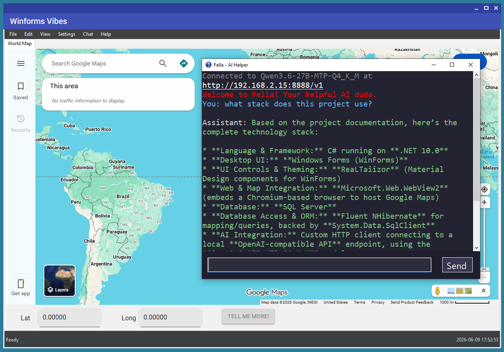

# Winforms Vibes

> This project was entirely vibe coded using a local Qwen3.6 LLM running on an NVIDIA RTX 3090 Ti with the latest Llama.cpp and MTP support.

A Windows Forms desktop application built with .NET 10.0, featuring a splash screen, menu bar, status bar, embedded Google Maps via WebView2, and AI chat powered by a local OpenAI-compatible endpoint.



## Features

- **Splash Screen** — displays application info (name, version, author, framework, database, server, user) fetched from the database. Bottom toolbar with a right-aligned Continue button to proceed.
- **Main Form** — menu bar with File, Edit, View, Chat, Settings, and Help menus. Restores to 1280×800 when unmaximized.
- **Title Bar Tooltips** — hovering over minimize, maximize, or close buttons on any window shows a tooltip ("Minimize", "Maximize"/"Restore Down", "Close")
- **World Map** — embedded Google Maps via WebView2 (Chromium-based). Lat/Long coordinates are populated by clicking the map or entering them manually in the coord panel.
- **Live Clock** — status bar clock that updates every second
- **Database Setup** — first-run wizard with inputs for server, database name, username, and password
- **Help Topics** — browsable help content covering project structure, GUI features, and usage
- **AI Chat** — chat with a local LLM via Chat > AI Chat
- **Fella - AI Helper** — context-aware help assistant that uses HelpInfo data to answer questions (Help > AI Help). Title bar shows a question mark icon and displays a red welcome message.
- **AI Map Chat** — singleton chat window opened by the "Tell Me More!" button. When coordinates are set (by clicking the map or entering Lat/Long), the button launches an AI agent that searches for the first city within a 5-mile radius and returns information about it. Exposes `AskAsync(string message)` for programmatic use. Assistant responses are green.
- **Help Sync** — HelpInfo table is automatically synced with HelpTopics.xml on every launch
- **Build Release** — BuildRelease.bat publishes a release to a timestamped folder under Releases/

## Requirements

- .NET 10.0 SDK
- SQL Server (local or remote) with `sa` authentication enabled
- Windows 10 or later (for WebView2 support)

## Quick Start

1. **Build**
   ```powershell
   dotnet build WinformsVibes.csproj -p:Configuration=Debug
   ```

2. **Run**
   ```powershell
   dotnet run --project WinformsVibes.csproj
   ```
   Or double-click `RunMe.bat` to build and launch directly.

3. **First Launch** — if no database is configured, a setup dialog appears. Enter server, database name, username, and password, then click **Create** (or press Enter). The app handles the rest.

4. **Build a Release** — run `BuildRelease.bat` to publish a distributable release to `Releases/Build-{timestamp}/`.

## Project Structure

| Path | Description |
|---|---|
| `Program.cs` | Entry point — database check, help sync, splash screen, main form |
| `SplashScreen.cs` | Startup splash with application info |
| `MainForm.cs` | Main application window with menu, tabs, and status bar |
| `WorldMapTab.cs` | World Map tab as a `UserControl` — WebView2, coord panel, Lat/Long inputs, "Tell Me More!" button |
| `DatabaseSetupDialog.cs` | First-run database creation dialog |
| `DbConfig.cs` | Database connection, Fluent NHibernate config, `SchemaExport` for table creation, seed logic, help sync |
| `DbSettings.cs` | Connection settings model and JSON config manager |
| `ChatWindow.cs` | AI chat window connecting to local OpenAI-compatible endpoint |
| `AIHelpWindow.cs` | AI-powered help assistant using HelpInfo context |
| `AIMapWindow.cs` | Singleton map chat window with `AskAsync` for programmatic use |
| `TitleBarTooltipForm.cs` | Base `Form` class that shows tooltips on minimize/maximize/close title bar buttons |
| `TitleBarTooltipMaterialForm.cs` | Same as above but extends `MaterialForm` for MainForm |
| `OpenAIChatClient.cs` | HttpClient-based OpenAI chat completions client |
| `HelpWindow.cs` | Browsable help topics window — groups by unique Category+Topic, shows all content values |
| `Models/` | Entity models (`ApplicationInfo`, `HelpInfo`) |
| `Maps/` | Fluent NHibernate maps (`ApplicationInfoMap`, `HelpInfoMap`). `Content` and `Dependencies` columns use `nvarchar(max)` via `CustomSqlType` |
| `HelpTopics.xml` | Help topics seeded into the database on creation and synced on every launch |
| `RunMe.bat` | Batch file launcher — builds then launches the app |
| `BuildRelease.bat` | Publishes a distributable release to `Releases/Build-{timestamp}/` |

## Configuration

The active database connection is stored in `dbconfig.json` (created automatically in the output directory). It contains `Server`, `DatabaseName`, `UserId`, and `Password` fields. Edit `DatabaseName` to switch databases, or delete the file to trigger the setup dialog on next launch.

## Help Topics

Edit `HelpTopics.xml` to add, remove, or modify help topics. On every launch, the HelpInfo table is truncated and re-seeded from the XML — the XML is the single source of truth.

## Dependencies

- **FluentNHibernate** v3.4.0 — Fluent NHibernate mappings
- **Microsoft.Web.WebView2** v1.0.3967.48 — Chromium-based web rendering
- **ReaLTaiizor** v3.8.1.8 — Material Design controls for WinForms
- **System.Data.SqlClient** v4.8.6 — SQL Server data access

## Known Issues

- WindowsBase version conflict warning (MSB3277) from WebView2 referencing net5.0 assemblies against net10.0 — harmless, safe to ignore
- Running via `dotnet run` in Git Bash exits immediately because the GUI detaches from the shell. Use `RunMe.bat` or the compiled `.exe` directly.

## Tests

Tests are in `Tests/` under `WinformsVibes.Tests.csproj` (NUnit 4.2.2).

```powershell
# Run all tests
dotnet test WinformsVibes.Tests.csproj

# Run database tests (requires SQL Server connection)
dotnet test WinformsVibes.Tests.csproj --filter "FullyQualifiedName~DatabaseTests"
```

`DatabaseTests` creates a test database (`testdb_schema`) and validates SchemaExport table creation and data seeding. A `OneTimeSetUp` drops the test database before each run to ensure a fresh schema.

## TODO

- [x] Validate HelpInfo data population on application start
